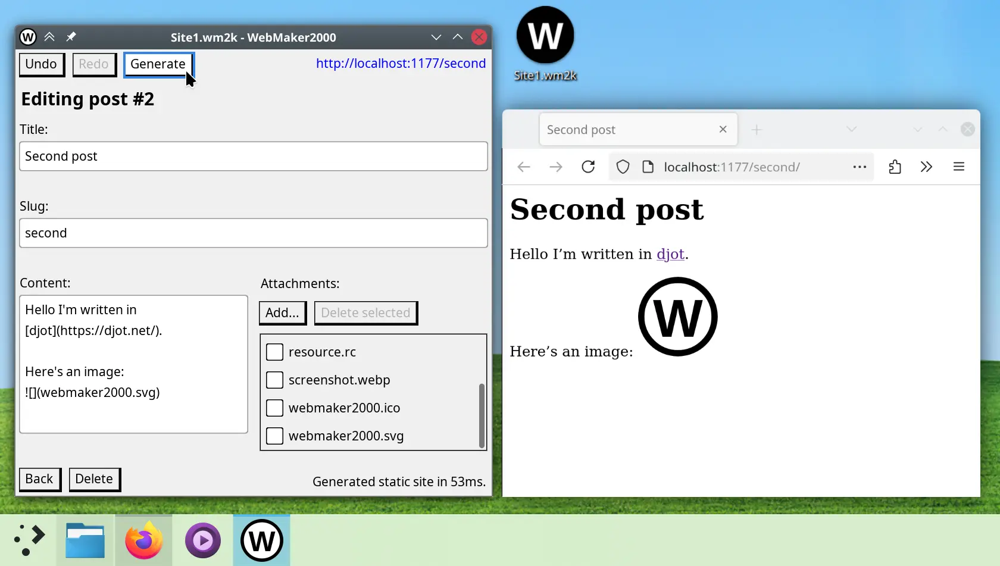

# What

WebMaker2000 is a (WIP) cross-platform static site generator with an
unapologetically spartan GUI:



The implementation is an experiment in [rubbing sqlite][1] on a desktop GUI:

Both data and GUI state are stored in an sqlite3 database, all of which are
queried every frame. All GUI actions trigger changes to the underlying db
instead of mutating any in-memory representation. This sounds expensive, but:

- dvui (the GUI library) only redraws when there is user interaction.
- sqlite has an in-memory page cache out of the box, so _read_ queries do not
  hit the disk every redraw.
- _write_ queries only happen when the user actually changes something, and
  even when they do, sqlite is [fast][3], especially now that SSDs are the norm.

What we gain is a massively simplified unidirectional state management system,
and we get **autosave** for free on every single action. We also get all of the
benefits of using sqlite as an application file format, chief among them being
**persistent undo/redo**, but also atomic writes, easy atomic schema changes,
powerful data modelling & querying capabilities.

Remaining puzzle to solve: background processing for tasks that take longer than
our per-frame budget:

- handling mid-operation crashes might be tricky?
- how would it interact with the undo thing?

MVP checklist:

- [x] Persistent undo/redo: Basically adapted [sqlite's guide][undo] to
  [emacs' undo style][emacs], which avoids accidentally losing data.
- [ ] Asset upload
- [ ] User-configurable deploy command (e.g. shelling out to rclone)
- [ ] Preview server
- [ ] User-customizable template system
- [ ] RSS/Atom feed
- [ ] OpenGraph tags

# Compile

Dependencies:

- Build time: zig master (0.14.0-dev.3271+bd237bced as of this writing)
- Runtime: libc

Statically compiled deps:

- sqlite3
- sdl3
- freetype2
- djot.lua, and obviously, lua


```sh
zig build run

# or, to watch:
find src | entr -rc zig build run

# optionally, to dynamically link to system libraries:
zig build -fsys=sdl3 -fsys=freetype -fsys=sqlite3 -fsys=lua

# conversely, to compile a super compatible executable that will Just Work on
# any GNU/Linux distro that's not older than Debian 10 "Buster":
zig build -Dtarget=x86_64-linux-gnu.2.28
```

# Linux desktop integration

Copy files from `./xdg` into your $HOME, or symlink using [stow][stow]:
`stow --no-folding --verbose=1 -t $HOME xdg`

[1]: https://www.hytradboi.com/2022/building-data-centric-apps-with-a-reactive-relational-database
[3]: https://www.sqlite.org/faq.html#q19
[stow]: https://www.gnu.org/software/stow/
[undo]: https://www.sqlite.org/undoredo.html
[emacs]: https://www.gnu.org/software/emacs/manual/html_node/emacs/Undo.html
